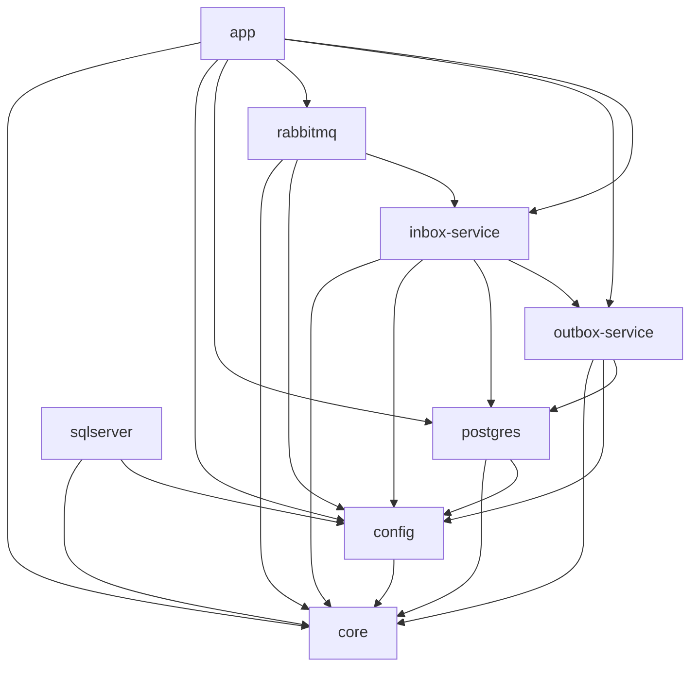
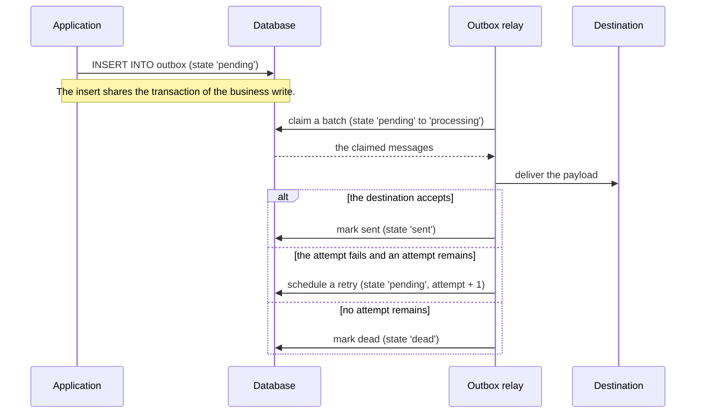
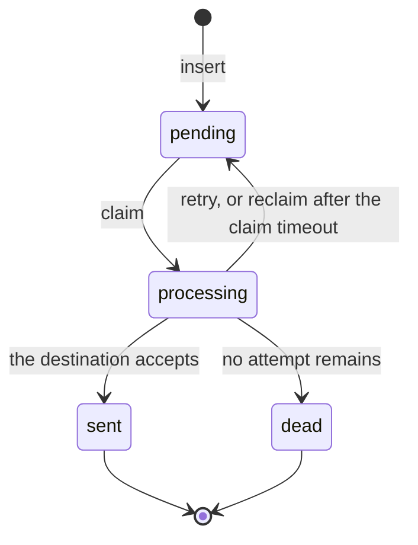
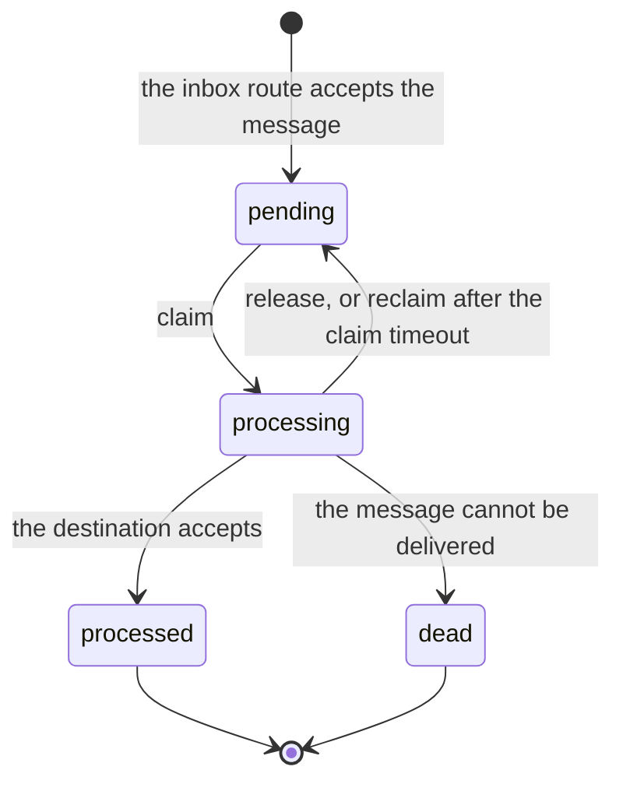

# Architecture

This document describes the modules, the message lifecycle and the message states. Every fact here
comes from the shipped code. A test asserts the state set and the column width against the source.

## Modules

The graph shows the Gradle project dependencies. It comes from the `build.gradle.kts` file of each
module.



The `core` module has no dependency on another module. The `sqlserver` module has no dependent
module. The `app` module does not depend on it. The repository layer loads a provider by
reflection, so a provider module can be absent at compile time. See
[ADR 0001](adr/0001-reflection-for-database-providers.md).

## Message lifecycle



The inbox follows the same shape. An HTTP client posts a message to the inbox route. The route
writes the row in state `pending`. The inbox relay claims the row, transforms it, forwards it to the
destination, and then writes state `processed` or state `dead`.

A claim that a crash leaves behind returns to state `pending`. The reclaim step finds a row that
stays in state `processing` longer than the visibility timeout.

## Outbox states



The outbox state set:

<!-- states:outbox -->
```text
pending
processing
sent
dead
```

## Inbox states



The inbox state set:

<!-- states:inbox -->
```text
pending
processing
processed
dead
```

## The state column

Both schemas declare the state column with a width of 50 characters. The PostgreSQL migration uses
`VARCHAR(50)`. The SQL Server migration uses `NVARCHAR(50)`. An earlier document stated
`VARCHAR(20)`. That statement was wrong.

## The state literals and MessageState

The repositories write the literals above. `MessageState` in `core` is the in-memory form.
`MessageState.Sent` carries both the outbox literal `sent` and the inbox literal `processed`.
`MessageState.Failed` is never written to the database. A repository returns it when it reads a
literal that it does not know.

## Decision: `canTransitionTo` is deleted

`MessageState.canTransitionTo` declared a transition table. No production code called it. A
repository-wide search found calls only in its own unit test. The table also contradicted the
repositories. It permitted `processing` to `failed`, and it refused `processing` to `pending`, but
the repositories write `pending` on a retry and never write `failed`.

The decision is to delete the function, and to delete `MessageStateTest.kt` with it. The reason is
that a rule which nothing enforces is a false claim about the product. The repositories hold the
state machine, and the diagrams above describe it. `DocumentedStateSetTest` now compares this
document against the repository sources, so the document and the code cannot drift apart.
